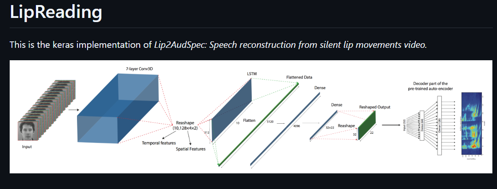
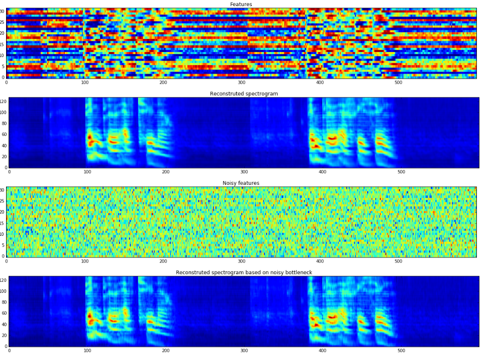
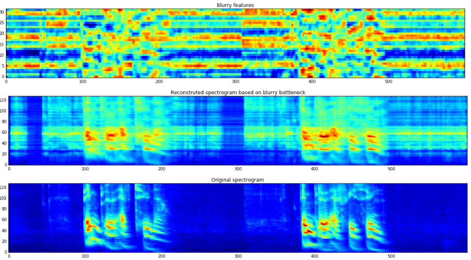
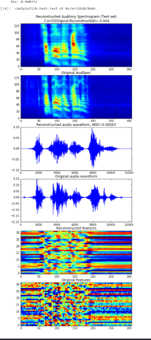

# 👄 Lip Reading Assistant — Visual Speech Recognition

> Predicting spoken words from lip movement alone — no audio input — using a CNN trained on the GRID corpus.


**Final Year Project · Pune Institute of Computer Technology · Aug 2023 – Apr 2024**

---

## 🎯 Results

| Metric | Value |
|---|---|
| Word-level classification accuracy | **~80%** |
| Dataset | GRID Corpus — 33,000 videos, 34 speakers |
| Training convergence speedup | **~35%** via hyperparameter tuning |
| Audio dependency | **None** — visual input only |

---

## 🏗️ Model Architecture



The pipeline combines a 7-layer Conv3D network for spatial and temporal feature extraction, followed by LSTM layers for sequence modelling, dense layers, and a pre-trained autoencoder decoder — reconstructing speech from silent lip movements alone.

---

## 📊 Output Samples

### Features & Reconstructed Spectrogram


The model extracts lip features (top) and reconstructs the audio spectrogram (second row). Even with noisy bottleneck features (third row), the reconstructed spectrogram (bottom) closely matches the original speech signal.

### Blurry Features vs Original Spectrogram


Comparison of blurry bottleneck features against the reconstructed and original spectrograms — demonstrating the model's robustness to input degradation.

### Audio Reconstruction Quality


End-to-end reconstruction results on the test set — showing the reconstructed auditory spectrogram, original audio, reconstructed waveform (MSE=0.00082), and feature comparison.

---

## ⚙️ How it works

```
Video input
    │
    ▼
Lip region extraction (OpenCV)
    │
    ▼
Frame sampling @ 25 fps
    │
    ▼
7-layer Conv3D → spatial + temporal features
    │
    ▼
LSTM → sequence modelling
    │
    ▼
Dense layers → Autoencoder decoder
    │
    ▼
Reconstructed speech spectrogram → predicted word
```

---

## 📁 Project structure

```
lip-reading-assistant/
│
├── assets/                       # Output screenshots
│   ├── architecture.png
│   ├── spectrogram_noisy.png
│   ├── spectrogram_blurry.png
│   └── reconstruction.png
│
├── preprocessing/
│   ├── lip_extractor.py          # Lip region detection and cropping
│   ├── frame_sampler.py          # Uniform frame sampling at 25 fps
│   └── tensor_pipeline.py        # Normalisation + tensor conversion
│
├── model/
│   ├── cnn_architecture.py       # Conv3D + LSTM architecture
│   ├── train.py                  # Training with LR scheduling
│   └── evaluate.py               # Accuracy + confusion matrix
│
├── notebooks/
│   └── experiment_log.ipynb      # Hyperparameter tuning experiments
│
└── README.md
```

---

## ▶️ How to run

```bash
git clone https://github.com/AmeyRathi12/lip-reading-assistant
cd lip-reading-assistant
pip install -r requirements.txt
python preprocessing/tensor_pipeline.py
python model/train.py
python model/evaluate.py
```

Dataset: Download [GRID Corpus](http://spandh.dcs.shef.ac.uk/gridcorpus/) and place under `data/grid_corpus/`.

---

## 💡 Key design decisions

- **Modular pipeline:** Each preprocessing stage is independent — swap dataset without rewriting inference logic
- **LR scheduling:** Reduced convergence time by ~35%
- **Zero audio:** Purely visual — applicable to hearing-impaired assistive technology use cases
